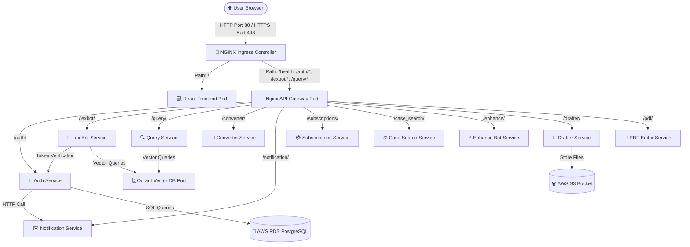

# ⚖️ DraftMate - Production Architecture & Developer Onboarding Guide

Welcome to the **DraftMate** workspace. This repository contains the source code, deployment templates, and pipeline configurations for the DraftMate platform. This document serves as the master guide for developers on boarding the project, explaining the architecture, configuration, credential management, and CI/CD workflow.

---

## 🗺️ System Architecture

DraftMate runs inside a multi-node **Kubernetes (Kind)** cluster hosted on a single AWS EC2 instance. It has been refactored from a monolith into a **decoupled microservices architecture** to achieve maximum reliability, failure isolation, and cost-effective scaling.

### 📐 Architecture Flow Diagram



---

## 🔑 Credential & Configuration Management

Environment variables and secret credentials are managed via **Helm Values**.

* **Default Configs**: Defined in [values.yaml](file:///d:/draftmate/draftmate_frontend_main_2/draftmate-chart/values.yaml). These are non-sensitive values.
* **Production Secrets**: Maintained on the EC2 host in `/home/ubuntu/draftmate_frontend_main_2/draftmate-chart/values-secrets.yaml`. **This file is ignored by Git and must never be committed.**

### How to Add/Configure Credentials:
1. To add a new environment variable to the system, declare it in [values.yaml](file:///d:/draftmate/draftmate_frontend_main_2/draftmate-chart/values.yaml) under `frontend.env` or `backend.env`.
2. For sensitive credentials (API keys, passwords), set a placeholder in `values.yaml` and override it in `values-secrets.yaml` on the server:
   ```yaml
   backend:
     env:
       GEMINI_API_KEY: "real-prod-api-key-here"
       OPENAI_API_KEY: "real-prod-api-key-here"
   ```
3. Apply changes to the live cluster:
   ```bash
   helm upgrade draftmate ./draftmate-chart -f ./draftmate-chart/values.yaml -f ./draftmate-chart/values-secrets.yaml
   ```

---

## 🚀 CI/CD Pipeline Workflow

We use **GitHub Actions** for automated build, test, and deployment.

* **Workflow File**: [.github/workflows/deploy.yml](file:///d:/draftmate/draftmate_frontend_main_2/.github/workflows/deploy.yml)
* **Trigger**: Triggered automatically on every `push` to the branch `preet/k8s-setup`.

### 🔄 The Deployment Steps:
1. **GitHub Runner**: Builds Frontend & Backend Docker images, runs security scans (OWASP and Trivy), and pushes tags to Docker Hub (`preetkakdiya/draftmate-*`).
2. **EC2 SSH Connection**: Connects to the host using Appleboy SSH.
3. **Pre-Deploy Cleanup**: Runs automatically before deploying to clear host disk space (pruning unused Docker containers, vacuuming journals, and keeping only **1** cached container image tag per node to prevent disk exhaustion).
4. **Helm Rollout**: Runs `helm upgrade` deploying the new tag.
5. **Post-Deploy Cleanup**: Prunes older dangling layers of the replaced tag.

---

## 📚 Repository Guides Index

For detailed, step-by-step instructions on specific subsystems, read the following guides:

* ☸️ **[Kubernetes Deployment Guide (k8sreadme.md)](file:///d:/draftmate/draftmate_frontend_main_2/k8sreadme.md)**: Full instructions on setting up Kind, Ingress, and structuring the `values-secrets.yaml` file.
* 🖥️ **[Server Setup & Recovery Guide (SERVER_SETUP_README.md)](file:///d:/draftmate/draftmate_frontend_main_2/SERVER_SETUP_README.md)**: Details on swap files, docker volumes, port routing, and manual disk-space recovery scripts.
* 🌐 **[API Endpoints Reference (endpoints.md)](file:///d:/draftmate/draftmate_frontend_main_2/endpoints.md)**: Full reference for the paths routed by the API Gateway.
